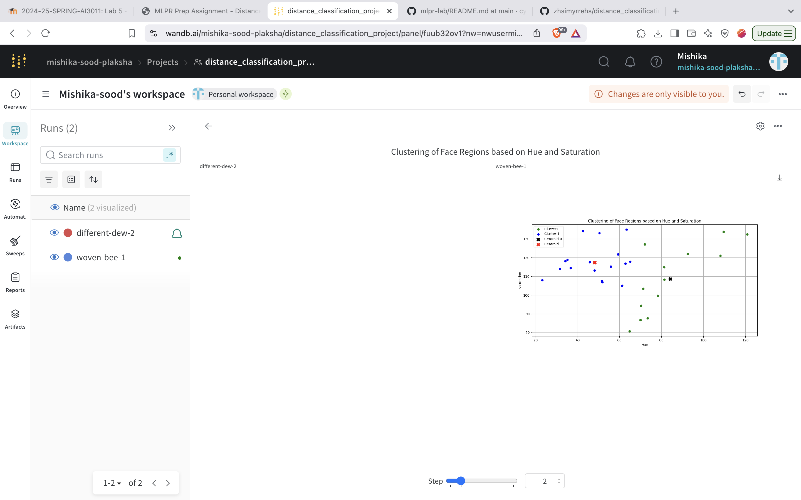
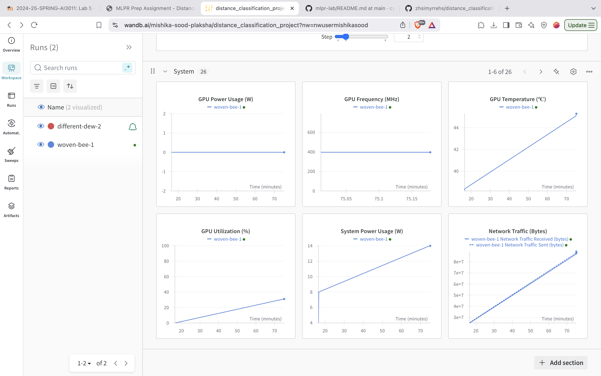
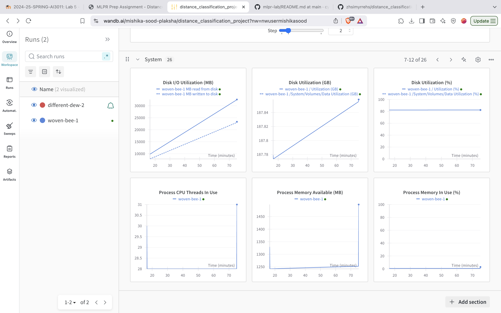
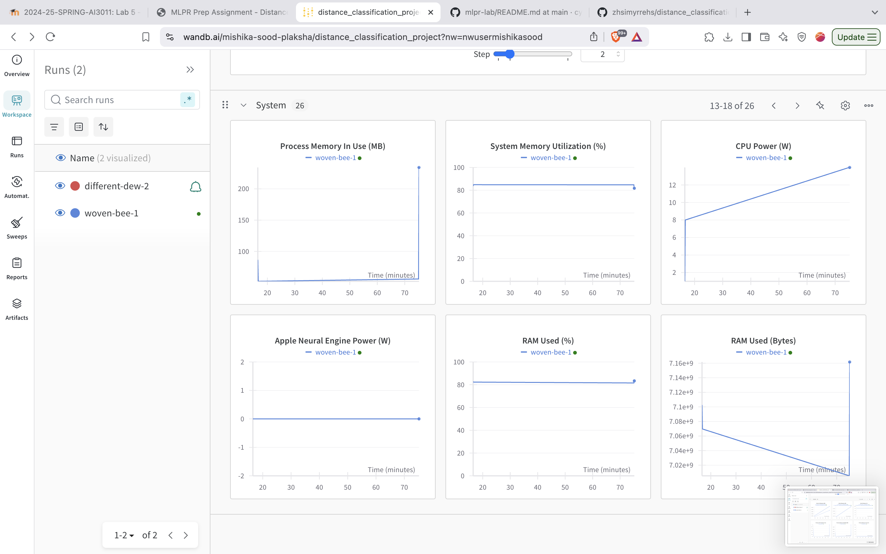
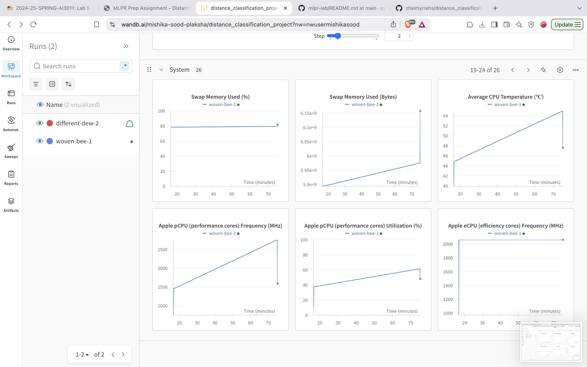
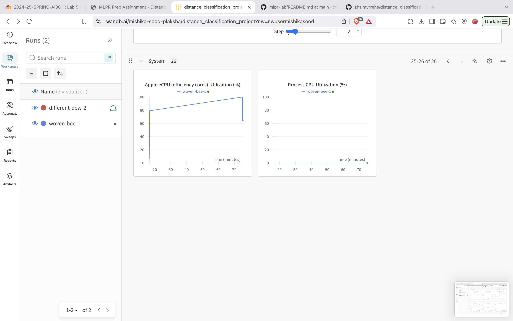
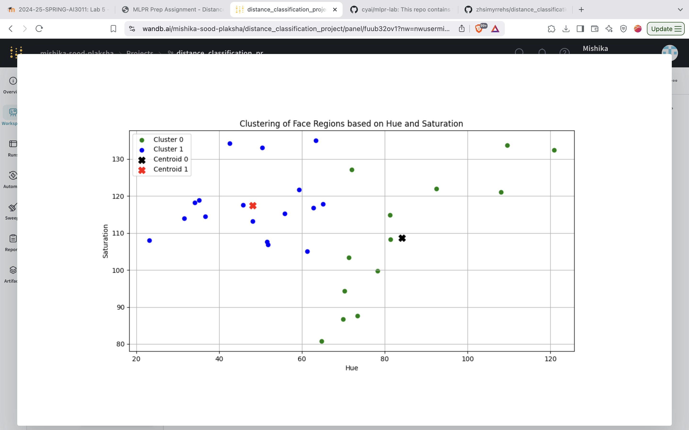

## Wandb Dashboard Screenshots

## Report

### 1. What are the common distance metrics used in distance-based classification algorithms? 

<h5> Some common distance metrics used in distance-based classification algorithms are: Euclidean distance, Manhattan distance, Minkowski distance, Hamming distance, Cosine similarity, Mahalanobis distance, Chebyshev Distance

### 2. What are some real-world applications of distance-based classification algorithms? 

<h5> Some real-world applications are: Recommendation Systems, Image Recognition, Fraud Detection, Spam Detection

### 3. Explain various distance metrics. 

<h5> Eucledian Distance - Measures direct spatial distance, commonly used in continuous data. It is the shortest distance between two points in space.

Manhattan distance - Measures the total number of steps required to move from one point to another along these straight paths. Measures distance along axes (L1 norm), useful for city block/grid-like data.

Minkowski Distance - This is a more flexible version of Euclidean and Manhattan distances. It has a parameter p that determines how the distance is calculated. When p=1, it becomes Manhattan distance; when p=2, it becomes Euclidean distance.

### 4. What is the role of cross validation in model performance? 

<h5> Cross-validation is a technique used to evaluate the performance of a model. It involves splitting the dataset into multiple subsets, training the model on some of the subsets, and testing it on the remaining subset. This helps to assess the model's performance on unseen data and avoid overfitting.

### 5. Explain variance and bias in terms of KNN? 

<h5> Variance is the model's sensitivity to training data. A high variance model will change significantly when trained on different subsets of the data, it learns noise and does not generalize well. Bias refers to the model's ability to capture the underlying patterns in the data. A high bias model may not be able to capture the complexity of the data, it makes strong assumptions and oversimplifies patterns. KNN is a high variance, low bias model, as it is sensitive to the training data and does not make strong assumptions about the underlying data distribution.